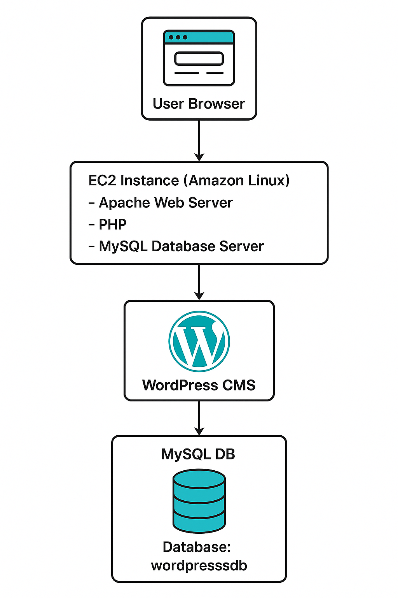

# 📦 WordPress Deployment on LAMP Stack (Amazon Linux)

This project explains how to deploy a WordPress website on an AWS EC2 instance using the **LAMP stack** (Linux, Apache, MySQL, PHP). It also enables WordPress theme uploads via **vsFTP**.

---

## 🧱 Architecture

## Installation Steps

1. #### Install LAMP Stack
       Install Apache, MySQL, and PHP on Amazon Linux EC2.
 2. #### 📦 Install WordPress Connector
           sudo yum install php8.4-mysqlnd.x86_64

 3. #### Download and Extract WordPress
         cd /var/www/html
         sudo wget https://wordpress.org/latest.tar.gz
         tar -xvzf latest.tar.gz
4. ####  Access WordPress
        Visit:
        http://<Your-Public-IP>/wordpress
 ### Database Setup

 5. #### Create MySQL Database
        mysql -u root -p

6. #### Inside MySQL:
       CREATE DATABASE wordpressdb;

### Use the following credentials on WordPress setup screen:

     Database Name: wordpressdb

     Username: root

     Password: root

     Database Host: localhost 

### Site Setup
    Site Title: TechBlog

    Username: root

    Password: root

    Email: t@gmail.com

### Grant WordPress directory permissions:
     sudo chmod -R 777 wordpress
### Complete WordPress installation and login at:
    http://<Your-Public-IP>/wordpress

### Theme Upload via FTP (vsFTP Setup)

6. #### Install and Configure vsFTPD
        sudo yum install vsftpd -y
        sudo systemctl start vsftpd
### Allow ports 20 and 21 in your EC2 Security Group

7. #### Add FTP User and Permissions
        sudo useradd vsftp
        sudo passwd vsftp
        sudo gpasswd -a vsftp apache
        sudo chown -R vsftp:apache /var/www/html/
        sudo systemctl restart vsftpd

8. #### WordPress FTP Settings
      ### During theme upload, use:

       Hostname: localhost

       FTP Username: vsftp

       FTP Password: root

 #### Post Deployment
    Login to Admin Panel

    Add new posts

    Install and activate new themes via FTP

## WordPress Deployment Summary (LAMP on AWS EC2)
This project shows how to deploy WordPress on an Amazon EC2 instance running Amazon Linux, using a LAMP stack (Linux, Apache, MySQL, PHP). It also includes FTP access to upload themes via vsFTPD.

